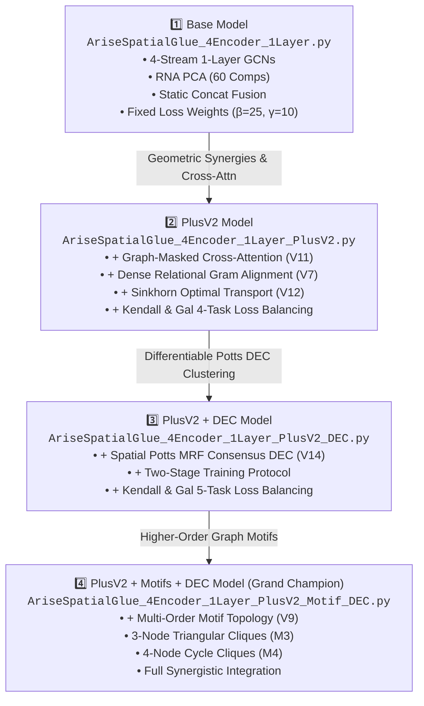
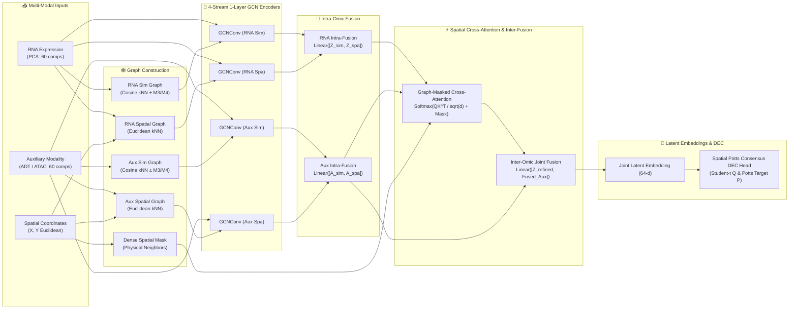
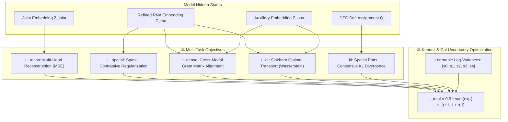

# 🧬 Arise-SpatialGlue: 4-Encoder 1-Layer Architecture Suite

Comprehensive multi-modal spatial transcriptomics and epigenomics/proteomics clustering suite utilizing **4-Stream Single-Layer Graph Convolutional Networks (GCNs)**, **Multi-Order Motif Topology**, **Spatially-Constrained Cross-Attention**, **Multi-Task Geometric Alignment Losses**, and **Spatial Potts MRF-Regularized Deep Embedding Clustering (DEC)**.

---

1. [Overview & Architectural Evolution](#-architectural-evolution)
2. [Workflow & Architecture Flowcharts (Mermaid)](#-architecture-diagrams)
3. [Deep Dive into Core Components](#-core-components)
4. [Master Comparison Matrix](#-master-comparison-matrix)
5. [Hyperparameters](#-hyperparameters)
6. [Codebase Registry](#-codebase-registry)
7. [Quickstart & CLI Commands](#-quickstart--cli-commands)
8. [Visual Analytics & Diagnostic Suite](#-visual-analytics--diagnostic-suite)
9. [Automatic Results Archiver](#-automatic-results-archiver)

---

## 🚀 Architectural Evolution



---

## 📊 Architecture Diagrams

### 1. Multi-Stream 4-Encoder Dataflow & Feature Fusion



---

### 2. Multi-Task Synergistic Loss Balancing Flow



---

## 🔬 Core Components

### 1. 📐 4-Stream 1-Layer GCN Architecture
Instead of deep multi-layer cascades that suffer from over-smoothing in dense spatial graphs, we employ four specialized single-layer graph convolutions:
* **$\text{GCN}_{\text{RNA, sim}}$**: Propagates transcriptomic expression over feature similarity graphs.
* **$\text{GCN}_{\text{RNA, dist}}$**: Propagates transcriptomic expression over Euclidean spatial graphs.
* **$\text{GCN}_{\text{Aux, sim}}$**: Propagates epigenetic/proteomic signals over modality similarity graphs.
* **$\text{GCN}_{\text{Aux, dist}}$**: Propagates epigenetic/proteomic signals over Euclidean spatial graphs.

### 2. 🕸️ Multi-Order Motif Topology (V9)
Enriches graph structures beyond standard 1-hop pairwise edges by calculating higher-order cliques:
* **3-Node Triangular Cliques**: $M_3 = (A \cdot A) \odot A$
* **4-Node Cycle/Cliques**: $M_4 = (A \cdot A \cdot A) \odot A$
* **Normalized Motif Graph**:
  $$A_{\text{motif}} = k_1 A + k_2 \frac{M_3}{\max(M_3)} + k_3 \frac{M_4}{\max(M_4)}$$

### 3. ⚡ Spatially-Constrained Cross-Attention (V11)
Protects cross-omic information exchange by restricting multi-head cross-attention strictly to physical Euclidean spatial neighbors:
$$\mathbf{A}_{i,j} = \text{Softmax}\left(\frac{\mathbf{Q}_i \mathbf{K}_j^\top}{\sqrt{d_k}} + \mathbf{M}_{\text{spatial}}\right), \quad \text{where } \mathbf{M}_{i,j} = \begin{cases} 0 & \text{if } (i,j) \in \mathcal{E}_{\text{spatial}} \\ -\infty & \text{otherwise} \end{cases}$$

### 4. 🔗 Dense Relational Gram Matrix Alignment (V7)
Forces the internal cell-cell correlation topology in RNA space to match the correlation topology in Auxiliary space:
$$\mathcal{L}_{\text{rel}} = \frac{1}{N^2} \|\mathbf{Z}_{\text{RNA}} \mathbf{Z}_{\text{RNA}}^\top - \mathbf{Z}_{\text{aux}} \mathbf{Z}_{\text{aux}}^\top\|_F$$

### 5. 🌊 Sinkhorn Entropic Optimal Transport (V12)
Computes differentiable Wasserstein optimal transport between modalities with entropic regularization to align global geometric probability manifolds:
$$\mathcal{L}_{\text{OT}} = \min_{T \in \Pi(\mu, \nu)} \langle T, C \rangle - \varepsilon H(T)$$

### 6. 🎯 Spatial Potts MRF-Regularized Consensus DEC (V14)
Two-stage clustering fine-tuning that eliminates "salt-and-pepper" spot misclassifications:
* **Student-$t$ Soft Assignment**:
  $$q_{i,j} = \frac{(1 + \|\mathbf{z}_i - \boldsymbol{\mu}_j\|^2 / \alpha)^{-\frac{\alpha+1}{2}}}{\sum_{j'} (1 + \|\mathbf{z}_i - \boldsymbol{\mu}_{j'}\|^2 / \alpha)^{-\frac{\alpha+1}{2}}}$$
* **Spatially-Smoothed Potts Target Distribution**:
  $$p_{i,j} \propto \frac{q_{i,j}^2}{\sum_k q_{k,j}} \cdot \exp\left(\lambda_{\text{spatial}} \sum_{n \in \mathcal{N}(i)} \frac{q_{n,j}}{|\mathcal{N}(i)|}\right)$$
* **Objective**: $\mathcal{L}_{\text{KL}} = \text{KL}(Q \parallel P)$.

### 7. ⚖️ Kendall & Gal Adaptive Multi-Task Loss Balancing
Eliminates rigid manual loss hyperparameter tuning by treating task weights as learnable homoscedastic uncertainties $s_i = \log \sigma_i^2$:
$$\mathcal{L}_{\text{total}} = \sum_{i} \left(\frac{1}{2} e^{-s_i} \mathcal{L}_i + \frac{1}{2} s_i\right)$$

---

## 📋 Master Comparison Matrix

| Capability | `Base` | `Base_OT` | `Base_DEC` | `Base_Dense_DEC` | `Base_OT_DEC` | `PlusV2` | `PlusV2_DEC` | `PlusV2_Motif_DEC` |
| :--- | :---: | :---: | :---: | :---: | :---: | :---: | :---: | :---: |
| **4-Stream 1-Layer GCNs** | ✅ | ✅ | ✅ | ✅ | ✅ | ✅ | ✅ | ✅ |
| **RNA PCA (60/100 Comps)** | ✅ | ✅ | ✅ | ✅ | ✅ | ✅ | ✅ | ✅ |
| **Multi-Order Motif Topology (V9)** | ❌ | ❌ | ❌ | ❌ | ❌ | ❌ | ❌ | ✅ |
| **Spatial Graph-Masked Cross-Attn (V11)** | ❌ | ❌ | ❌ | ❌ | ❌ | ✅ | ✅ | ✅ |
| **Dense Gram Relational Loss (V7)** | ❌ | ❌ | ❌ | ✅ | ❌ | ✅ | ✅ | ✅ |
| **Sinkhorn Optimal Transport Loss (V12)** | ❌ | ✅ | ❌ | ❌ | ✅ | ✅ | ✅ | ✅ |
| **Spatial Potts Consensus DEC (V14)** | ❌ | ❌ | ✅ | ✅ | ✅ | ❌ | ✅ | ✅ |
| **Kendall & Gal Uncertainty Balancing** | ❌ (Static) | ❌ (Static) | ❌ (Static) | ❌ (Static) | ❌ (Static) | ✅ (4 Tasks) | ✅ (5 Tasks) | ✅ (5 Tasks) |
| **Training Regime** | 1-Stage | 1-Stage | 2-Stage | 2-Stage | 2-Stage | 1-Stage | 2-Stage | 2-Stage |
| **Output Directory** | `results/` | `results_ot/` | `results_dec/` | `results_dense_dec/` | `results_ot_dec/` | `results_arise_plus_v2/` | `results_arise_plus_v2_dec/` | `results_arise_plus_v2_motif_dec/` |

---

## ⚙️ Hyperparameters

The models use either static hyperparameters or Kendall & Gal dynamic uncertainty weighting:

| Hyperparameter | Symbol | `Base` Variants | `PlusV2` Variants | Description |
| :--- | :---: | :--- | :--- | :--- |
| **Reconstruction Loss Weight** | `beta` ($\beta$) | 25.0 (Static) | Dynamic (`p0`) | Weight for MSE reconstruction loss |
| **Spatial Contrastive Loss Weight** | `gamma` ($\gamma$) | 10.0 (Static) | Dynamic (`p1`) | Weight for spatial similarity regularization |
| **Dense Relational Loss Weight** | `lambda_dense` | 1.0 (Static, `Dense_DEC`) | Dynamic (`p2`) | Weight for Gram matrix alignment |
| **Sinkhorn OT Loss Weight** | `lambda_ot` | 1.0 (Static, `OT`) | Dynamic (`p3`) | Weight for Optimal Transport loss |
| **DEC KL Divergence Weight** | `kl_weight` ($\kappa$) | 1.0 (Static) | Dynamic (`p4`) | Weight for clustering distribution alignment |
| **L1/L2 Regularization** | `delta` ($\delta$) | 1.0 (Static) | 1.0 (Static) | Generic network weight regularization |

*Note: PlusV2 variants use learnable log-variances ($s_i$) initialized to 0.0, transforming into dynamic precision weights $p_i = \exp(-s_i)$.*

---

## 📂 Codebase Registry

| File | Primary Purpose | Best Suited For |
| :--- | :--- | :--- |
| [`AriseSpatialGlue_4Encoder_1Layer.py`](file:///Users/imran/Developer/FYDP/forGit/Arise+SpatialGlue/AriseSpatialGlue_4Encoder_1Layer.py) | Lightweight 4-encoder 1-layer baseline | Standard baseline benchmarking |
| [`AriseSpatialGlue_4Encoder_1Layer_DEC.py`](file:///Users/imran/Developer/FYDP/forGit/Arise+SpatialGlue/AriseSpatialGlue_4Encoder_1Layer_DEC.py) | 4-encoder 1-layer baseline + Spatial Potts DEC | Baseline with differentiable cluster smoothing |
| [`AriseSpatialGlue_4Encoder_1Layer_Dense_DEC.py`](file:///Users/imran/Developer/FYDP/forGit/Arise+SpatialGlue/AriseSpatialGlue_4Encoder_1Layer_Dense_DEC.py) | 4-encoder 1-layer baseline + Dense Gram Relational Loss + Spatial Potts DEC | Baseline with Gram matrix alignment and cluster smoothing |
| [`AriseSpatialGlue_4Encoder_1Layer_OT.py`](file:///Users/imran/Developer/FYDP/forGit/Arise+SpatialGlue/AriseSpatialGlue_4Encoder_1Layer_OT.py) | 4-encoder 1-layer baseline + Sinkhorn Optimal Transport | Baseline with optimal transport probability alignment |
| [`AriseSpatialGlue_4Encoder_1Layer_OT_DEC.py`](file:///Users/imran/Developer/FYDP/forGit/Arise+SpatialGlue/AriseSpatialGlue_4Encoder_1Layer_OT_DEC.py) | 4-encoder 1-layer baseline + Sinkhorn OT + Spatial Potts DEC | Baseline with optimal transport and cluster smoothing |
| [`AriseSpatialGlue_4Encoder_1Layer_PlusV2.py`](file:///Users/imran/Developer/FYDP/forGit/Arise+SpatialGlue/AriseSpatialGlue_4Encoder_1Layer_PlusV2.py) | Synergistic geometric losses + spatial attention | Clean single-stage multi-modal alignment |
| [`AriseSpatialGlue_4Encoder_1Layer_PlusV2_DEC.py`](file:///Users/imran/Developer/FYDP/forGit/Arise+SpatialGlue/AriseSpatialGlue_4Encoder_1Layer_PlusV2_DEC.py) | Synergistic losses + 2-stage Spatial Potts DEC | Differentiable cluster smoothing without motifs |
| [`AriseSpatialGlue_4Encoder_1Layer_PlusV2_Motif_DEC.py`](file:///Users/imran/Developer/FYDP/forGit/Arise+SpatialGlue/AriseSpatialGlue_4Encoder_1Layer_PlusV2_Motif_DEC.py) | Complete Grand Champion integration | Peak ARI performance & spatial domain continuity |

---

## ⚡ Quickstart & CLI Commands

### 1. Run Base Pipeline
```bash
!python AriseSpatialGlue_4Encoder_1Layer.py --datasets all --seeds 42 1234 2024 --rna_pca_comps 60 --epochs 350 --visualize
```

### 2. Run Base + DEC Pipeline
```bash
!python AriseSpatialGlue_4Encoder_1Layer_DEC.py --datasets all --seeds 42 1234 2024 --rna_pca_comps 60 --epochs 400 --visualize
```

### 3. Run Base + Dense + DEC Pipeline
```bash
!python AriseSpatialGlue_4Encoder_1Layer_Dense_DEC.py --datasets all --seeds 42 1234 2024 --rna_pca_comps 60 --epochs 400 --visualize
```

### 4. Run Base + OT Pipeline
```bash
!python AriseSpatialGlue_4Encoder_1Layer_OT.py --datasets all --seeds 42 1234 2024 --rna_pca_comps 60 --epochs 350 --visualize
```

### 5. Run Base + OT + DEC Pipeline
```bash
!python AriseSpatialGlue_4Encoder_1Layer_OT_DEC.py --datasets all --seeds 42 1234 2024 --rna_pca_comps 60 --epochs 400 --visualize
```

### 6. Run PlusV2 Pipeline (Cross-Attn + Geometric Losses)
```bash
!python AriseSpatialGlue_4Encoder_1Layer_PlusV2.py --datasets all --seeds 42 1234 2024 --rna_pca_comps 60 --epochs 400 --visualize
```

### 7. Run PlusV2 + DEC Pipeline (Two-Stage Fine-Tuning)
```bash
!python AriseSpatialGlue_4Encoder_1Layer_PlusV2_DEC.py --datasets all --seeds 42 1234 2024 --rna_pca_comps 60 --epochs 400 --visualize
```

### 8. Run Grand Champion Pipeline (Motifs + Losses + DEC)
```bash
!python AriseSpatialGlue_4Encoder_1Layer_PlusV2_Motif_DEC.py --datasets all --seeds 42 1234 2024 --rna_pca_comps 60 --epochs 400 --visualize
```

---

## 📈 Visual Analytics & Diagnostic Suite

Each pipeline automatically generates a complete visual diagnostic report stored in `plots/`:
1. **Multi-Task Training Curves (`curves/`)**:
   * Total loss, Reconstruction loss, Spatial contrastive loss, Gram alignment loss, Sinkhorn OT loss, and DEC KL loss trajectories.
   * Silhouette score progression with best-epoch indicator.
   * ARI trajectory showing peak ARI and ARI at best Silhouette epoch.
   * Dashed line marking Stage 1 $\to$ Stage 2 DEC transition.
2. **2D Spatial Domain Maps (`spatial/`)**:
   * Side-by-side spot scatter maps comparing Ground Truth vs. Predicted Spatial Domains.
3. **4-Panel UMAP & Silhouette Reports (`umap_silhouette/`)**:
   * Panel 1: UMAP colored by Ground Truth annotations.
   * Panel 2: UMAP colored by Predicted Domains with ARI score.
   * Panel 3: UMAP heatmap of cell-level Silhouette coefficients.
   * Panel 4: Silhouette Knife Profile plot per domain with mean threshold.
4. **Violin Distribution Profiles (`violin/`)**:
   * Spot silhouette coefficient distribution per domain.
   * Latent dimension 1 feature activation per domain.

---

## 📥 Automatic Results Archiver

To automatically trigger a direct browser download of the results archive in your Kaggle notebook, run:

```python
import os
import base64
import shutil
from IPython.display import HTML

# Target folder: choose from results_arise_plus_v2, results_arise_plus_v2_dec, or results_arise_plus_v2_motif_dec
target_folder = "results_arise_plus_v2_motif_dec"
zip_filename = f"/kaggle/working/{target_folder}_Results.zip"
shutil.make_archive(zip_filename.replace('.zip', ''), 'zip', target_folder)

with open(zip_filename, "rb") as f:
    b64 = base64.b64encode(f.read()).decode()

html_code = f"""
<a id="auto_dl" href="data:application/zip;base64,{b64}" download="{os.path.basename(zip_filename)}"></a>
<script>
    document.getElementById('auto_dl').click();
</script>
<p>🚀 <b>Results archive download started automatically in your browser!</b></p>
"""
display(HTML(html_code))
```
